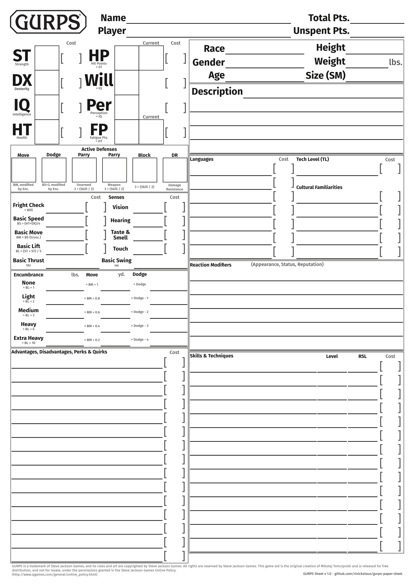
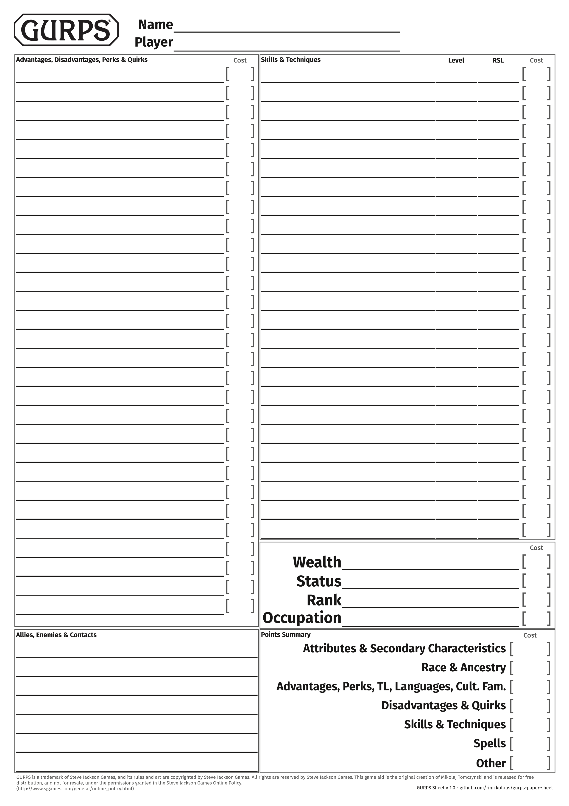
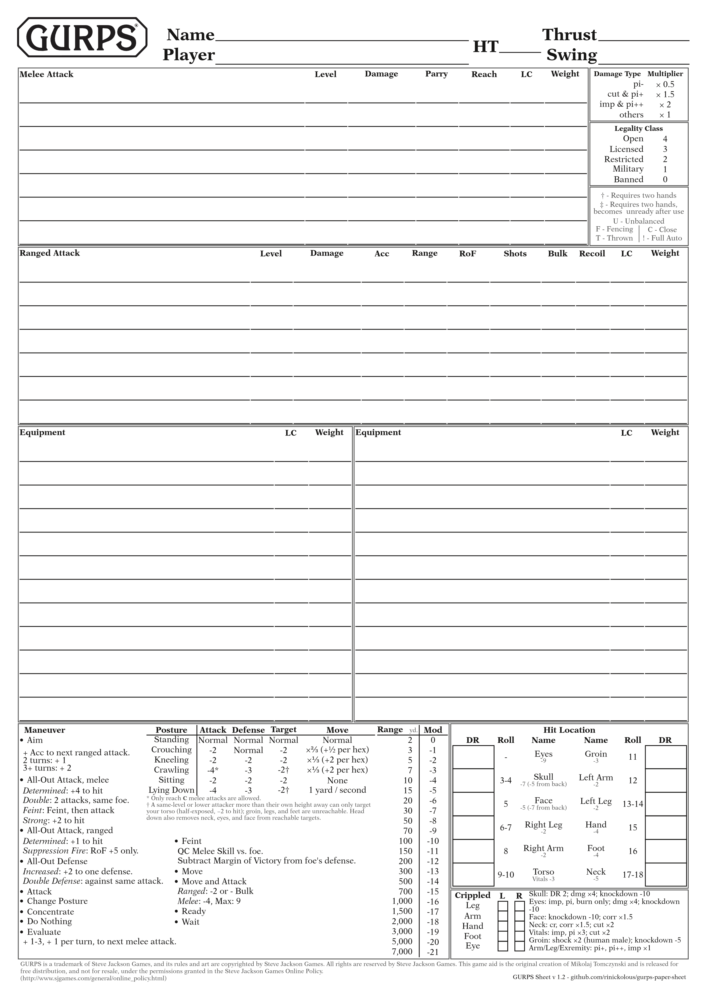
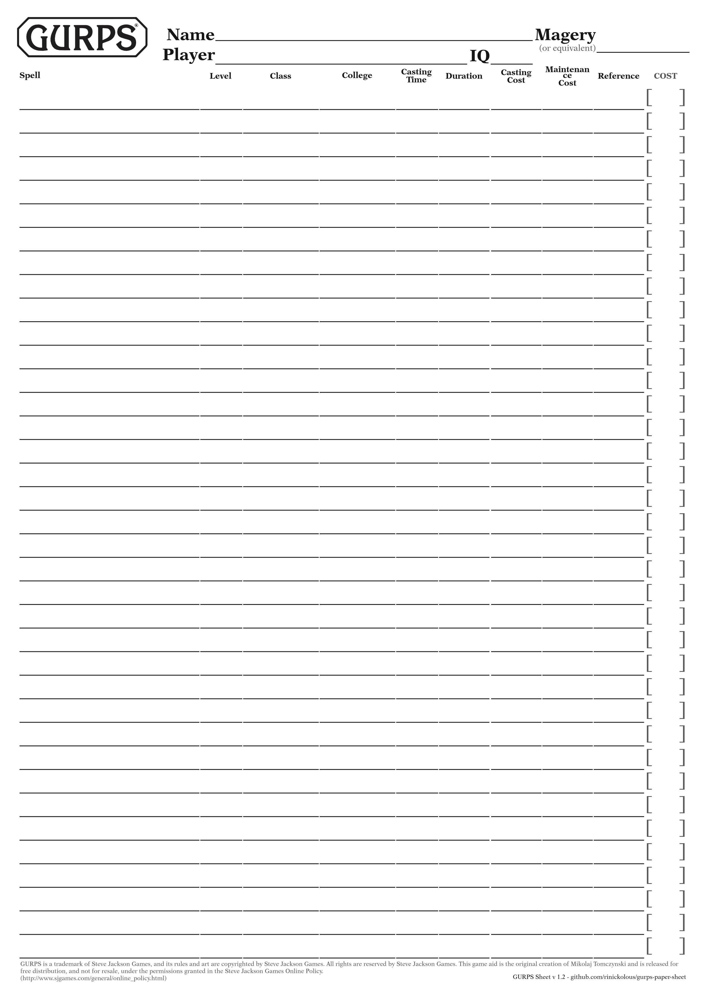
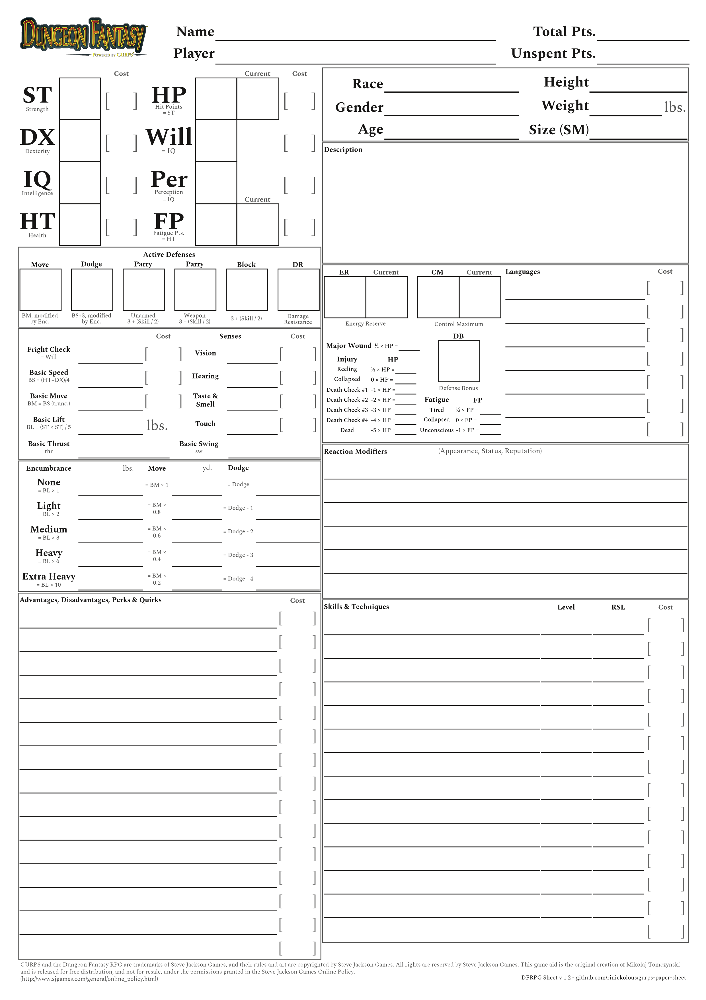
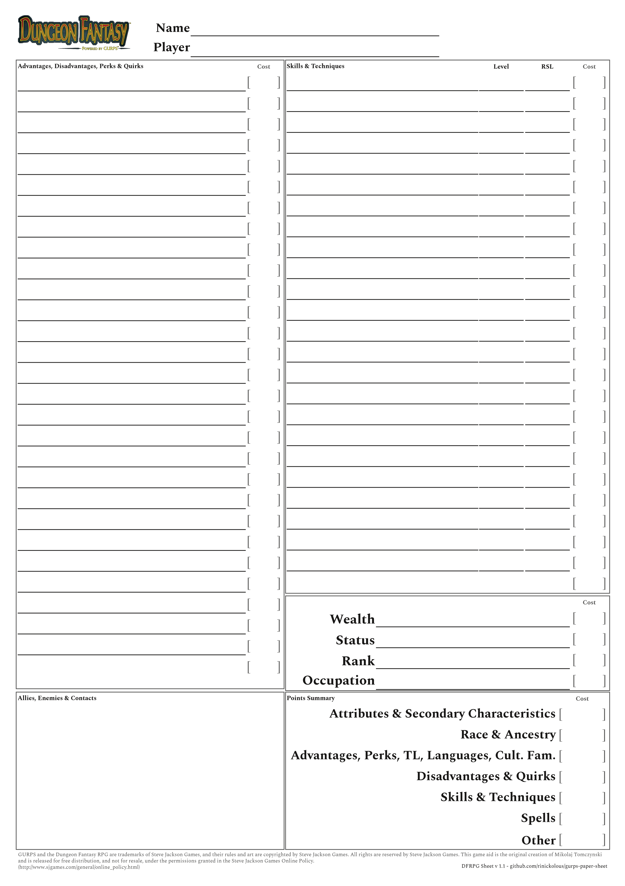
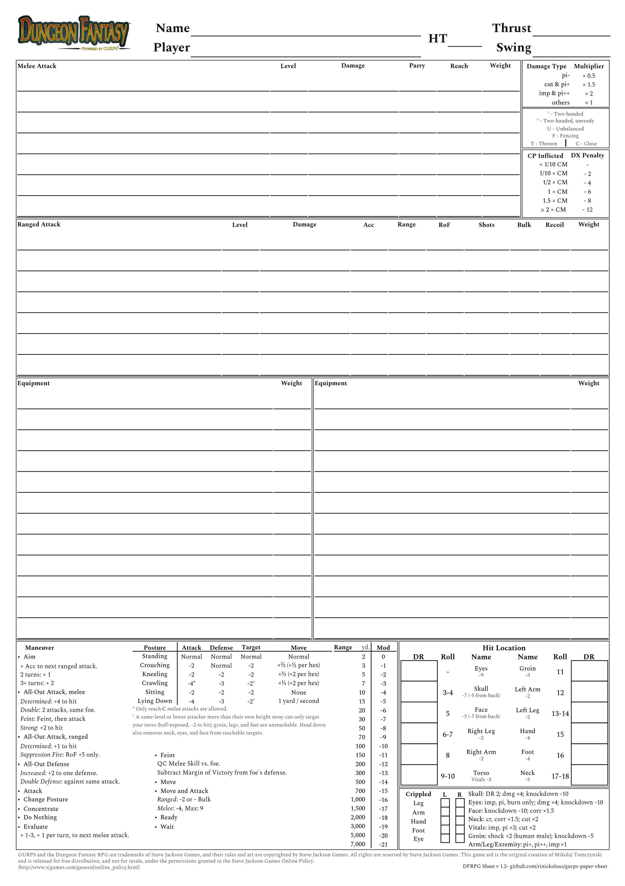
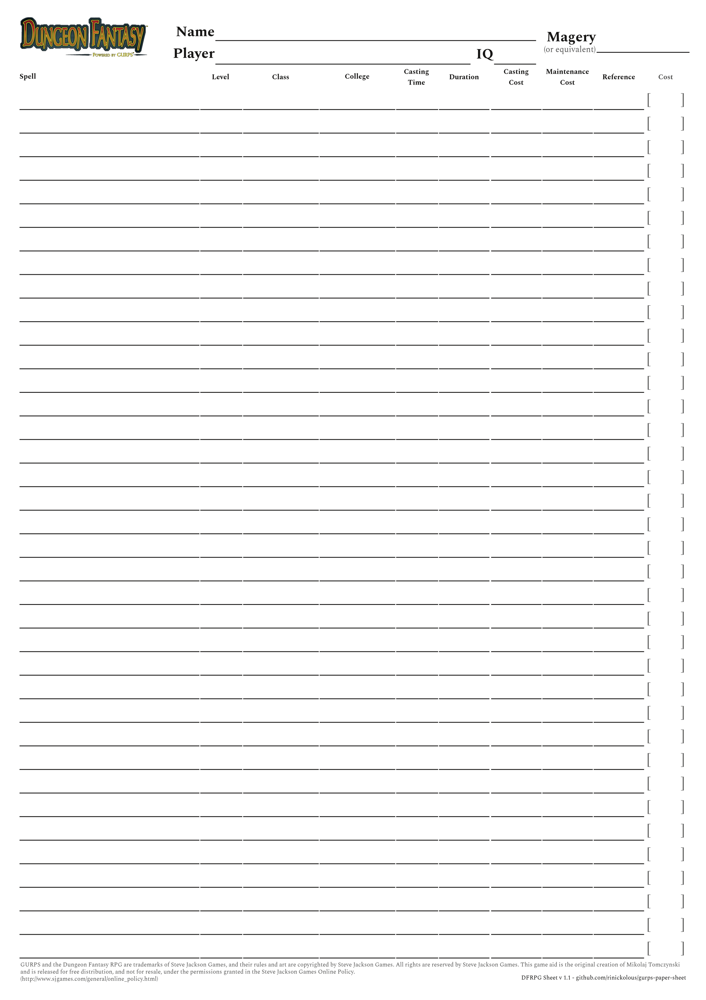

# GURPS Printable Character Sheets

A printable GURPS character sheet in A4 format, laid out in Scribus. Designed to fit all the core character information onto paper in a clean, readable way.

## Screenshots

**Standard Sheet**

| Page 1                                         | Page 2                                         | Page 3                                         | Page 4                                         |
| :--------------------------------------------: | :--------------------------------------------: | :--------------------------------------------: | :--------------------------------------------: |
|  |  |  |  |

**DFRPG Sheet**

| Page 1                                         | Page 2                                         | Page 3                                         | Page 4                                         |
| :--------------------------------------------: | :--------------------------------------------: | :--------------------------------------------: | :--------------------------------------------: |
|  |  |  |  |

## Files

- `a4-standard.sla` — standard A4 sheet
- `a4-dfrpg.sla` — variant for the Dungeon Fantasy RPG boxed set

## Tools Used

- [Scribus](https://www.scribus.net/) — open-source desktop publishing, used for layout and design

## Fonts

The fonts used in this project are entirely free and open-source, available from [Google Fonts](https://fonts.google.com/). They include:

- Fira Sans
- Spectral

## Printing

Open the `.sla` file in Scribus and export to PDF (File → Export → Save as PDF). A4 paper size is assumed; if printing on US Letter, enable "Shrink page contents to paper size" in your PDF viewer.

## Contributing

Contributions are welcome. If you want to fix a layout issue, add a variant, or improve the design:

1. Fork the repo
2. Make your changes in Scribus
3. Open a pull request with a brief description of what changed and why

Please keep changes focused — one logical change per PR makes review easier. If you're unsure whether something is in scope, open an issue first.

## Legal

The material presented here is my original creation, intended for use with the [GURPS](http://www.sjgames.com/gurps/) system from [Steve Jackson Games](http://www.sjgames.com/). This material is not official and is not endorsed by Steve Jackson Games.

GURPS is a trademark of Steve Jackson Games, and its rules and art are copyrighted by Steve Jackson Games. All rights are reserved by Steve Jackson Games.
This game aid is the original creation of Mikolaj tomczynski and is released for free distribution, and not for resale, under the permissions granted in the [Steve Jackson Games Online Policy](http://www.sjgames.com/general/online_policy.html).
